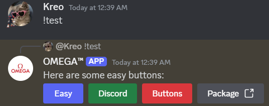

# easy-discord-buttons


[](LICENSE)

A simple and user-friendly package for creating Discord buttons with Discord.js.

## Features
- Simplify button creation in Discord.js.
- Supports all button styles (`Primary`, `Secondary`, `Success`, `Danger`, `Link`).
- Easily create action rows containing buttons.

## 📦 Installation

```bash
npm install easy-discord-buttons
```

---

## 🚀 Usage

```javascript
const EasyDiscordButtons = require('easy-discord-buttons');


const primaryButton = EasyDiscordButtons.createButton(
    "Click Me",        // Label
    "example_id",      // Custom ID
    "primary",         // Style (case-insensitive)
    null,              // URL (not needed for non-Link styles)
    false              // Disabled (optional, default: false)
);

```

# Create a Button
```javascript
EasyDiscordButtons.createButton(label, customId, style, url = null, disabled = false)
```
Creates a Discord button easily.

- label: The text displayed on the button.
- customId: A unique identifier for the button (except for Link buttons).
- style: The style of the button (Primary, Secondary, Success, Danger, Link).
- url (optional): Required for Link buttons. The URL to redirect to.
- disabled (optional): Whether the button is disabled.

# Create a Row
```javascript
EasyDiscordButtons.createRow(buttons)
```
Creates a row of buttons.

- buttons: An array of ButtonBuilder objects.

---

## 🧑‍💻 Example for Multiple Buttons
```javascript
const { createButton, createRow } = require('easy-discord-buttons');

// Create buttons
const button1 = createButton("Primary", "btn_1", "primary");
const button2 = createButton("Danger", "btn_2", "danger");
const button3 = createButton("Visit Website", null, "link", "https://example.com");

// Create a row with these buttons
const actionRow = createRow([button1, button2, button3]);
```
## 🧑‍💻 Example for Link Buttons
```javascript
const linkButton = EasyDiscordButtons.createButton(
    "Visit Website",  // Label
    null,             // No customId for Link buttons
    "link",           // Style
    "https://example.com", // URL
    false             // Disabled (optional, default: false)
);

await message.channel.send({ content: 'Visit Easy-Discord-Buttons Package!:', components: [EasyDiscordButtons.createRow([linkButton])] });

```

---

## 📝 License

This project is licensed under the MIT License - see the [LICENSE](LICENSE) file for details.

---
